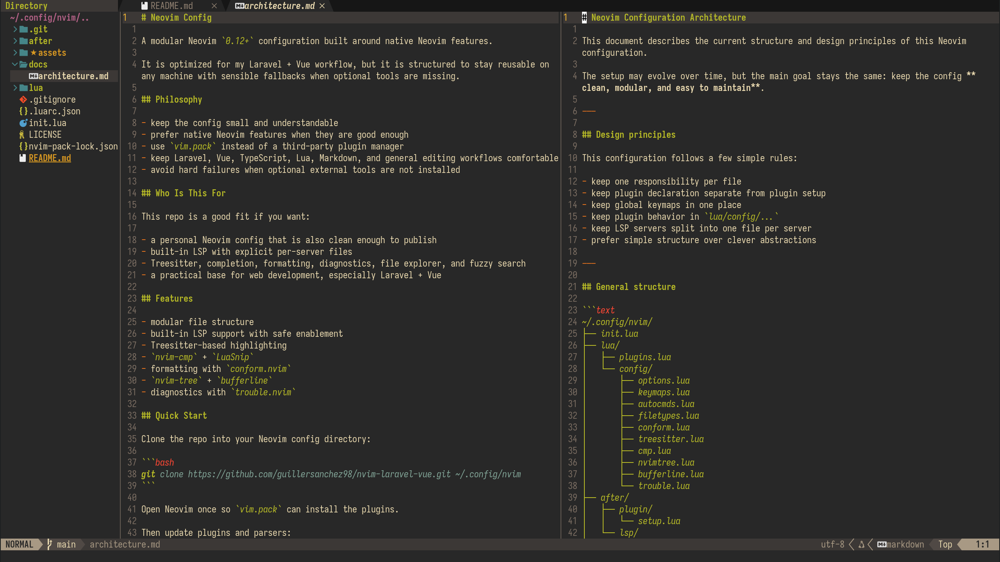

# Neovim Configuration for PrestaShop

A modular **Neovim `0.12+`** configuration built around native Neovim features and tuned for **PrestaShop** development.



## Focus

This repository is meant to be a clean daily-driver setup for working on:

- PHP in PrestaShop projects
- Smarty templates (`.tpl`)
- Twig templates (`.twig`)
- HTML, CSS, SCSS, and JavaScript around themes and modules
- Lua and Markdown for editor work and documentation

## Workflow modules

Internally, the branch is organized around small workflow modules under `lua/config/workflows/`.

- `core` = shared editor, UI, completion, and baseline LSP behavior
- `prestashop` = Smarty/Twig support, Twiggy, PrestaShop root detection, and `php-cs-fixer`

The idea is simple: the branch keeps those workflows available, but workflow-specific setup is only activated when the current project or buffer matches it.

## What it includes

- native Neovim LSP configuration under `after/lsp/`
- Treesitter for the parsers this setup installs explicitly
- autocompletion with `nvim-cmp` + `LuaSnip`
- formatting through `conform.nvim`
- diagnostics UI with `trouble.nvim`
- file explorer with `nvim-tree`
- fuzzy finding with `fzf-lua`
- Smarty filetype support through `blueyed/smarty.vim`

## Main workflow

- PHP: `intelephense`
- PHP formatting: `php-cs-fixer`
- Twig: `twiggy-language-server`
- HTML and Smarty markup: `vscode-html-language-server`
- Tailwind classes in markup assets: `tailwindcss-language-server`
- Markdown: `marksman`
- Lua: `lua-language-server` + `stylua`

## Branch strategy

If you keep specialized branches, the cleanest approach now is:

- keep shared editor behavior in `core`
- keep branch-specific behavior in `lua/config/workflows/*`
- avoid forking `init.lua`, `lua/plugins.lua`, `lua/config/filetypes.lua`, and `lua/config/conform.lua` unless the architecture itself changes

That keeps branch diffs small and makes merges back into `main` much easier.

## Quick start

```bash
git clone https://github.com/guisfus/nvim-prestashop.git ~/.config/nvim
```

Open Neovim once so `vim.pack` can install plugins.

Then run:

```vim
:lua vim.pack.update()
:TSUpdate
:checkhealth
```

After `:lua vim.pack.update()`, confirm plugin updates with `:write` in the confirmation buffer.

## Requirements

- Neovim `0.12+`
- `git`
- a Nerd Font

## Recommended CLI tools

- `fzf`
- `ripgrep`
- `fd` or `fdfind`
- clipboard provider such as `xclip`, `xsel`, or `wl-clipboard`

## Language tools

Install the tools that match the features you want to use.

### LSPs and language servers

- `lua-language-server`
- `intelephense`
- `vscode-html-language-server`
- `@tailwindcss/language-server`
- `twiggy-language-server`
- `marksman`

### Formatters

- `php-cs-fixer`
- `prettier`
- `stylua`

## Suggested installs

### Node-based tools

```bash
npm install -g \
  vscode-langservers-extracted \
  @tailwindcss/language-server \
  prettier
```

### PHP tools

Prefer project-local binaries when available, especially for `php-cs-fixer`.

```bash
composer require --dev friendsofphp/php-cs-fixer
```

If you prefer a global install, make sure `php-cs-fixer` is on your `PATH`.

### Lua tooling

```bash
cargo install stylua
```

## Filetypes handled by this repository

- `.php` -> `php`
- `.tpl` -> `smarty`
- `.twig` -> `twig`

`smarty` keeps its own filetype, but also gets HTML-language support so editing PrestaShop templates is less bare.

## Useful commands

- `:lua vim.pack.update()`
- `:TSUpdate`
- `:checkhealth`
- `:LspInfo`
- `:ConformInfo`

## Keymaps

The leader key is `<Space>`.

### Search

- `<leader>ff` -> find files
- `<leader>fg` -> live grep
- `<leader>fb` -> buffers

### Explorer

- `<leader>e` -> toggle `nvim-tree`
- `<leader>o` -> focus `nvim-tree`

### Diagnostics

- `<leader>cd` -> line diagnostics
- `]d` -> next diagnostic
- `[d` -> previous diagnostic
- `<leader>xx` -> workspace diagnostics in Trouble

### Formatting

- `<leader>fc` -> format current file

### LSP

- `K` -> hover
- `gd` -> definition
- `gD` -> declaration
- `gi` -> implementation
- `go` -> type definition
- `<leader>rn` -> rename
- `<leader>ca` -> code action

## Repository layout

```text
~/.config/nvim/
├── after/
│   ├── lsp/
│   └── plugin/
├── docs/
├── lua/
│   ├── config/
│   │   ├── lsp/
│   │   └── workflows/
│   └── plugins.lua
├── init.lua
└── nvim-pack-lock.json
```

## Notes

- `intelephense` is the main PHP LSP for this repository.
- `twiggy-language-server` is used only for Twig files.
- `php-cs-fixer` is resolved from `vendor/bin/php-cs-fixer` first and falls back to the global binary.
- warnings for missing binaries are deferred until you open a matching filetype
- `smarty` and `twig` get LSP support here, but not automatic formatting by default because that usually requires extra formatter plugins.
- Treesitter is only started automatically for the filetypes this config installs parsers for explicitly.

See [`docs/architecture.md`](docs/architecture.md) for the internal structure.
